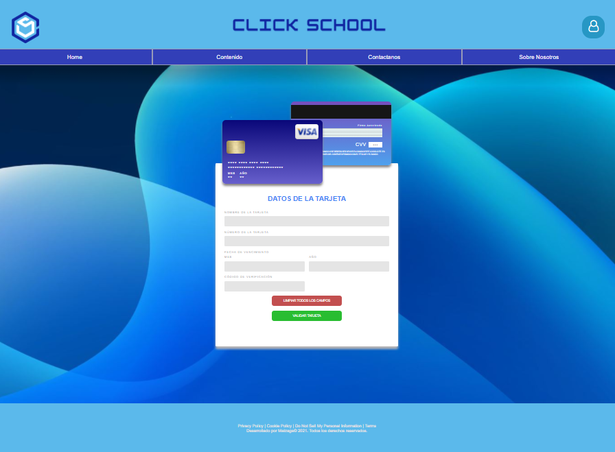
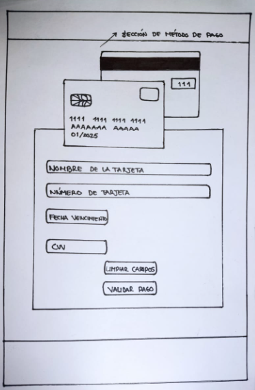
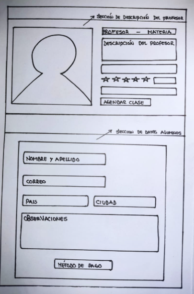
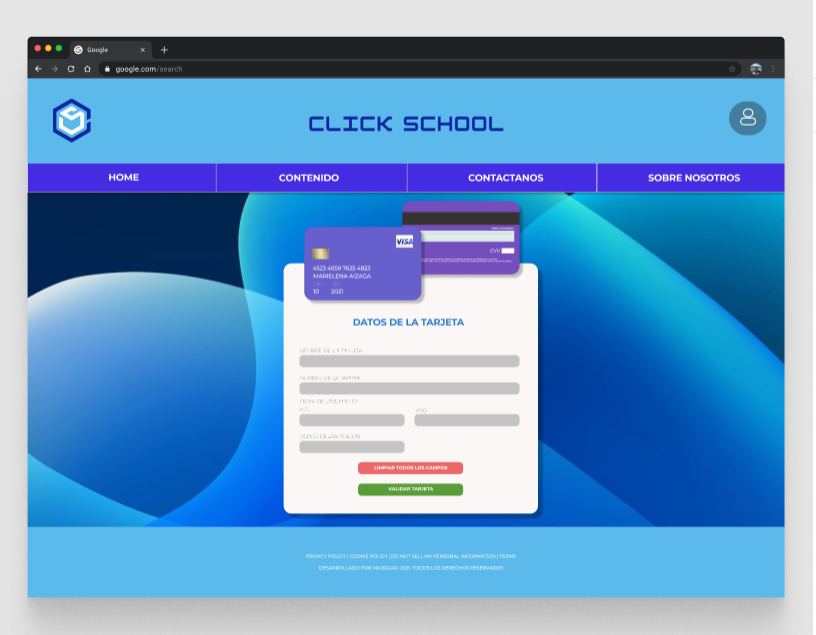

# CLICK SCHOOL

## DESCRIPCIÓN

Click School es una plataforma de clases online y en esta parte del proyecto implementamos la validación de tarjetas de crédito y débito como medio de pago. 

## VISUALIZACIÓN DEL PROYECTO FINAL 

## APROXIMACIÓN AL CLIENTE

### Usuarios del producto

Click School es una plataforma online que brinda un espacio para que alumnos y profesores puedan conectarse entre ellos, para desarrollar habilidades en distintas disciplinas (artes, idiomas, tecnología, etc.) en modalidades de mentoría. 

Este producto esta dirigido a todos los usuario de la plataforma de aprendizaje CLICK SCHOOL y fue diseñado con la finalidad de brindarle una alternativa de validación de pago, para tarjetas de crédito como tarjetas de débito.

### Problema y Solución

Los Usuarios de Click School requerian de una interfaz que le permitiera a sus alumnos el poder pagar los servicios de la plataforma por medio de la implementación de tarjetas. 

De esta manera, la interfaz le permite al usuario culminar de manera sencilla e interactiva el proceso de validación de tarjeta al momento de realizar el pago.

## Intrucciónes de uso

### Para validar los datos:

* Ingresar los datos solicitados en el formulario.
* A medida que se ingresen los datos, se reflejara en la tarjeta que se encuentra en la parte superior del formulario. 
* Una vez ingresada la información deberá presionar el boton "validar tarjeta".
* Se le indicara si su tarjeta es válida para así poder terminar el proceso de pago.
* En caso desee borrar todos los campos, puede hacer uso del boton "Limpiar Campos"
## PROTOTIPADO INICIAL

A continuación los prototipos iniciales a lápiz y plumón. 

;

;

## PUNTOS A MEJORAR PARA LAS NUEVAS VERSIONES 

Durante el proceso de desarrollo del proyecto, se recolectó feedback de compañeras de Laboratoria, couches y familiares para mejorar y desarrollar las funcionalidades desde una perspectiva de usuario. 

De la misma manera me aportaron importantes colaboraciones en el área de estílos, tamaños y colores. 

### Puntos a mejorar:

* Agregar la funcionalidad de los botones que se encuentran en el "navBar".
* El despliegue de las otras ventanas y/o formularios necesarios para las otras secciones de la plataforma.
* Mensaje de verificación en ventanas modales en lugar de alerts.
* Agregar la funcionalidad del boton "Limpiar Campos". 
* Agregar la funcionalidad del boton de usuario. 

## PROTOTIPO FINAL 

Para la realización del prototipo final se utilizó Figma como herramienta de diseño y prototipado. 

[Enlace al prototipo de Figma](https://www.figma.com/file/bMULLO4I33zmT1xvQejuIi/prototipo%2Fventana-de-pago%2FLIM016-card-validation?node-id=0%3A1)

## CONDICIONES DEL PROYECTO 

A conticnuación encontrarás el link [README.md](https://github.com/Laboratoria/LIM016-card-validation) que contiene las especificaciones bajo las cuales se realizo el proyecto. 

